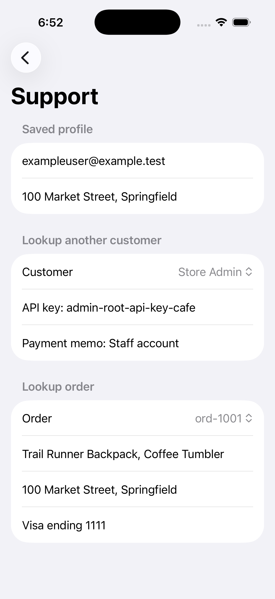
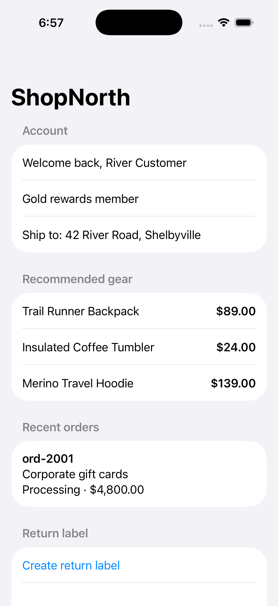
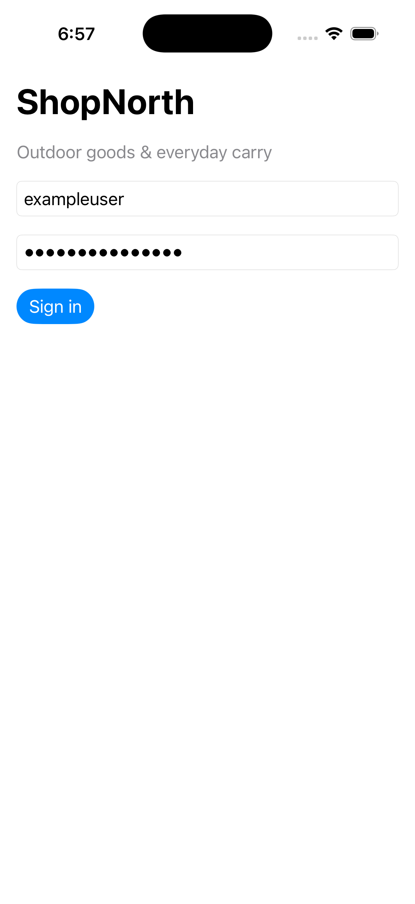

# RedAI Report: Example iOS App

RedAI ran a security review of /Users/kyle.polley/code/e2e-ios using the **balanced** scan coverage tier and validator environment `45513272-23b6-409e-9d6f-230e261570aa`. This report was generated on 2026-04-17T12:05:03.686Z for run `7a680c4a-dcc3-48c8-8591-4c7d6984a3b1` (status: completed).

## Executive Summary

6 findings were produced across 11 analysis units. Of these, 5 confirmed, 1 not exploitable after automated validation. 40 supporting artifacts were collected during the run.

## Threat Model

ShopNorth is a SwiftUI iOS shopping application (bundle ID com.redai.ShopNorthE2E) used for local simulator testing. It is a single-view app with no network layer—all data is hardcoded in-memory. The app includes customer sign-in, product display, order history, return-label generation, a support/customer-lookup view, and a staff directory. Despite being labeled a test/demo app, the patterns and data it contains establish several threat-relevant surfaces because test apps often get promoted or copied into production, and even demo credentials and keys can leak into CI artifacts, logs, or device backups.

### Architecture

Entirely client-side iOS app with no backend API, no network calls, and no database. All state lives in hardcoded constants in ContentView.swift (demoUsers and demoOrders arrays containing usernames, API keys, addresses, payment memos, and a hardcoded credential pair), @AppStorage/UserDefaults (session token and user ID persisted via @AppStorage and direct UserDefaults writes), and the filesystem Documents directory (return-label feature writes plaintext files containing user name, address, and session token). (SwiftUI iOS shopping application (single-view, no network layer, all data hardcoded in-memory, bundle ID com.redai.ShopNorthE2E)). Primary technologies: SwiftUI, iOS, Xcode, @AppStorage (UserDefaults), NSLog, Documents directory filesystem writes, Auto-generated Info.plist (GENERATE_INFOPLIST_FILE = YES), Automatic code signing (CODE_SIGN_STYLE = Automatic).

### Assets

| Asset | Sensitivity | Description |
| --- | --- | --- |
| Hardcoded Login Credentials | high | Plaintext username/password pair (exampleuser / examplepassword) present in ContentView.swift and README.md, used by the signIn() function for authentication. |
| Embedded API Keys | high | Three API keys embedded in the demoUsers array: shopnorth-user-api-key-7f2d, river-private-api-key-91ab, and admin-root-api-key-cafe. The admin key signals a key hierarchy that, if mirrored in a real backend, would grant administrative access. |
| Session Token | high | Predictable session token constructed as 'hardcoded-ios-session.<username>.shopnorth' with no randomness, no expiration, and no device binding. Stored in UserDefaults under two keys (sessionToken and apiSessionToken). |
| User PII (Names, Addresses, Emails) | high | User display names, shipping addresses, and email addresses present in the demoUsers array and exposed through support and staff directory views. |
| Payment Memos and Card Data | high | Payment memos including what appears to be a corporate card number and approval code (RIVER-SECRET) stored in the demoOrders/demoUsers arrays. |
| Return Label Plaintext File | high | File written to the Documents directory by createReturnLabel(for:) containing user display name, address, and raw session token with no encryption, no data-protection class annotation, and no cleanup lifecycle. |
| UserDefaults Plist File | high | Plaintext plist file at Library/Preferences/com.redai.ShopNorthE2E.plist containing session token and user ID, not protected by Keychain, included in device backups. |
| System Logs (NSLog Output) | high | Unified system log entries containing usernames, session tokens, and file paths written by signIn() and createReturnLabel(for:) via NSLog calls. |
| README.md with Credentials | high | README.md file committed to version control containing login credentials in plaintext under a Local Credentials heading, visible to anyone with repository read access. |
| Committed Build Artifacts | medium | build/ directory committed to the repository containing compiled module caches and an info.plist with local filesystem path (/Users/kyle.polley/code/e2e-ios/ShopNorthE2E.xcodeproj). |
| Unsigned App Bundle | medium | The .app bundle from the build/ directory carrying no code signature (DEVELOPMENT_TEAM = empty string, no entitlements file), offering no tamper-detection guarantees. |

### Recommended Focus Areas

**Verify Hardcoded Credentials and API Keys Extractable from App.** Hardcoded credentials and API keys (including admin-root-api-key-cafe) in source code are the highest-impact finding. Validate they are present in the compiled binary and accessible from the repository.

**Validate Plaintext Session Token and PII Written to Disk.** Return-label files and UserDefaults contain session tokens and PII in plaintext. Trigger return-label generation and sign-in, then inspect the Documents directory and plist for sensitive data exposure.

**Confirm Broken Access Control Exposes All User Data.** Any authenticated user (including customer-role exampleuser) can access admin API keys, all customer PII, and payment memos through the staff directory and support views. Sign in and navigate to these views to confirm.

**Check NSLog Output for Sensitive Data Leakage.** NSLog calls in signIn() and createReturnLabel(for:) emit session tokens and usernames to the system log. Monitor the unified log during these operations to confirm exposure.

**Inspect Repository for Credential and Build Artifact Leakage.** README.md contains plaintext credentials and the build/ directory contains developer paths and unsigned compiled artifacts. Review the repository contents for these exposures.


### Threats

| Severity | Likelihood | Category | Title |
| --- | --- | --- | --- |
| high | high | business-logic | Hardcoded Credentials in Source Code |
| high | high | business-logic | Sensitive Data Written to Plaintext on Disk |
| high | high | business-logic | Session Token Stored in UserDefaults Without Protection |
| high | high | business-logic | No Authorization Boundaries — Any Authenticated User Sees All Data |
| medium | high | business-logic | Sensitive Data Logged via NSLog |
| medium | high | business-logic | README Exposes Credentials in the Repository |
| medium | medium | supply-chain | Build Artifacts Committed to the Repository |
| low | low | business-logic | No App Transport Security or Network Hardening Configuration |
| medium | medium | supply-chain | No Code Signing Team or Entitlements |

## Scan Coverage

Coverage tier: **balanced**. RedAI prioritized 3 of 2 candidate files for deeper review.

| Score | Path | Category | Rationale |
| --- | --- | --- | --- |
| 0.98 | `ShopNorthE2E/ContentView.swift` | — | Single most security-critical file; contains hardcoded credentials (plaintext username/password, API keys including admin-root-api-key-cafe), predictable session token construction, insecure token storage via @AppStorage/UserDefaults, sensitive data written to plaintext file, NSLog leaking sensitive data, broken access control exposing all customers' API keys/payment details/addresses with no role check, and embedded PII in data literals. Scored just below 1.0 only because some purely presentational UI code is intermixed. |
| 0.65 | `README.md` | — | Contains plaintext login credentials under a 'Local Credentials' heading, representing a credential-leakage concern at the repository level. Does not contain executable logic but does contain the same hardcoded secrets that appear in ContentView.swift. Noted outside the original candidate list. |
| 0.10 | `ShopNorthE2E/ShopNorthE2EApp.swift` | — | Standard SwiftUI app entry point, ~10 lines of boilerplate. No credentials, storage logic, network calls, or security-relevant configuration. Only marginal reason to scan is to confirm no custom scene-phase handlers or background-task registrations, but inspection confirms there are none. Effectively inert from a security perspective. |

No files are excluded outright; both candidate .swift files are actual source files. ShopNorthE2EApp.swift is effectively inert from a security perspective and could reasonably be skipped if scan budget is very tight. README.md and build/ directory were not in the original candidate list but are called out by the threat model — README.md for plaintext credential leakage and build/ for committed build artifacts leaking developer filesystem paths. These are noted for downstream scanner awareness.

## Summary of Findings

The table below summarizes the findings of the review, including category and severity.

| # | Title | Category | Severity | Validation |
| --- | --- | --- | --- | --- |
| 1 | Hardcoded Credentials and API Keys in Source Code and Compiled Binary | other | high | confirmed (high) |
| 2 | Broken Access Control — Any Authenticated User Sees All Users' Data | other | high | confirmed (high) |
| 3 | Predictable Session Token with Insecure Storage and Incomplete Logout Cleanup | other | high | confirmed (high) |
| 4 | Session Token and PII Written to Unprotected Plaintext File on Disk | other | high | confirmed (high) |
| 5 | Session Tokens and Usernames Logged via NSLog to the Unified System Log | other | medium | confirmed (high) |
| 6 | Build Artifacts and Developer Paths Committed to Repository with No .gitignore | other | medium | not-exploitable (high) |

## Detailed Findings

### 1. Hardcoded Credentials and API Keys in Source Code and Compiled Binary

| | |
| --- | --- |
| **Severity:** high | **Confidence:** high |
| **Category:** other | **Finding ID:** `finding-1` |
| **Target:** `ShopNorthE2E/ContentView.swift:172`, `ShopNorthE2E/ContentView.swift:38`, `ShopNorthE2E/ContentView.swift:39` (+6 more) | **Validation:** confirmed (high) |

**Description**

Anyone who can clone the repository, access a fork, or obtain the committed build artifact can extract login credentials, three API keys (including an admin-level key), payment card fragments, and predictable session tokens — all stored as plaintext string literals. The secrets appear in `ContentView.swift`, are repeated in `README.md`, and survive compilation into the `build/` binary, where a single `strings` command reveals every value. The `@State` properties even default to the valid username and password, so the app ships ready to authenticate with no user input.

**Affected Locations**

- `ShopNorthE2E/ContentView.swift:172` — signIn() (Literal credential comparison: guard username == "exampleuser", password == "examplepassword")
- `ShopNorthE2E/ContentView.swift:38` — @State properties (@State properties default to the correct credentials, so the app launches ready to sign in with no user input)
- `ShopNorthE2E/ContentView.swift:39` — @State properties (@State properties default to the correct credentials (password))
- `ShopNorthE2E/ContentView.swift:24` — demoUsers (demoUsers array contains three API keys as string literals, including admin-root-api-key-cafe on the admin account)
- `ShopNorthE2E/ContentView.swift:28` — demoUsers (demoUsers array contains API keys as string literals)
- `ShopNorthE2E/ContentView.swift:30` — demoOrders (demoOrders array contains paymentMemo: "Corporate card 4242, approval RIVER-SECRET" — a realistic-looking card number fragment and approval code)
- `ShopNorthE2E/ContentView.swift:33` — demoOrders (demoOrders array contains payment memo with realistic financial data)
- `README.md:5` — Local Credentials (Credentials repeated under a "Local Credentials" heading (lines 5–8))
- `build/` — compiled binary (Committed compiled binary containing all credentials and API keys as extractable plaintext strings)

**Exploit Scenario**

An attacker with read access to the repository opens `ContentView.swift` or simply runs `strings` against the committed `ShopNorthE2E.debug.dylib` binary. The output immediately yields `admin-root-api-key-cafe`, `shopnorth-user-api-key-7f2d`, `river-private-api-key-91ab`, the login pair `exampleuser` / `examplepassword`, payment memo data including "Corporate card 4242, approval RIVER-SECRET", and a predictable session-token format (`hardcoded-ios-session.<user>.shopnorth`). If any of these keys are reused against a staging or production backend, the admin key grants full administrative access. Even without a live backend, an attacker who obtains a device backup can read the simulator's `UserDefaults` plist and find the session token persisted in plaintext, enabling session hijacking on any environment that trusts it.

**Recommendations**

Remove every credential, API key, and payment string from source code, the README, and the committed `build/` directory, then rotate any values that may have been used against a real service. For development and test flows, inject secrets through environment variables or `.xcconfig` files excluded via `.gitignore`, and gate demo-only authentication behind a `#if DEBUG` compiler directive so it cannot ship in release builds. Replace realistic-looking payment data (card number fragments, approval codes) with obviously fake placeholders such as `TEST-ONLY-0000` to prevent accidental leakage of patterns that resemble real financial information.

**Inline Evidence**

*Output of `strings` on the compiled binary — every hardcoded secret is recoverable in plaintext.* — from `artifacts/validation/CBC8640E-5DF5-4549-96C7-AA582DAF21AE/binary-secrets-extracted.txt`:

```
examplepassword
hardcoded-ios-session.
Visa ending 1111
Corporate card 4242, approval RIVER-SECRET
shopnorth-user-api-key-7f2d
river-private-api-key-91ab
admin-root-api-key-cafe
```

*Simulator UserDefaults after sign-in — the predictable session token is persisted in plaintext.* — from `artifacts/validation/CBC8640E-5DF5-4549-96C7-AA582DAF21AE/userdefaults-dump.txt`:

```
{
  "apiSessionToken" => "hardcoded-ios-session.exampleuser.shopnorth"
  "sessionToken" => "hardcoded-ios-session.exampleuser.shopnorth"
  "sessionUserId" => "u-100"
}
```

**Validation Evidence**

All hardcoded secrets from the finding are confirmed present in the compiled binary and at runtime. Running `strings` on ShopNorthE2E.debug.dylib reveals all hardcoded API keys (admin-root-api-key-cafe, shopnorth-user-api-key-7f2d, river-private-api-key-91ab), login credentials (exampleuser/examplepassword), predictable session tokens, and payment card data in plaintext. Source code (ContentView.swift) hardcodes 3 user records with plaintext API keys, emails, addresses, and payment memos; 2 order records with card data; and a predictable session token pattern. README.md publishes login credentials in plaintext. Runtime UserDefaults confirms the hardcoded session token persisted in plaintext. The API keys are local demo tokens with no associated remote service endpoints. The primary risk is credential/PII leakage through binary analysis, source code exposure, or device backup extraction.

Reproduction steps:

1. 1. Build and install the ShopNorthE2E app on an iOS simulator.
2. 2. Run `strings` on the compiled binary ShopNorthE2E.debug.dylib inside the .app bundle to extract plaintext secrets.
3. 3. Verify extracted strings include: admin-root-api-key-cafe, shopnorth-user-api-key-7f2d, river-private-api-key-91ab, examplepassword, hardcoded-ios-session.<user>.shopnorth, payment card data (4242, Visa ending 1111).
4. 4. Inspect ContentView.swift source to confirm hardcoded user records with API keys, emails, addresses, payment memos, login credentials, and predictable session token format.
5. 5. Inspect README.md to confirm plaintext login credentials (exampleuser / examplepassword).
6. 6. Launch the app in the simulator, sign in with the hardcoded credentials, and dump the simulator UserDefaults plist to confirm session tokens persisted in plaintext (apiSessionToken and sessionToken both set to hardcoded-ios-session.exampleuser.shopnorth).

Payloads tried: `strings ShopNorthE2E.debug.dylib (binary strings extraction)`, `Login with exampleuser / examplepassword (hardcoded credentials from README and source)`, `UserDefaults plist dump to extract persisted session tokens`.

Evidence artifacts:

- [file] Binary secrets extracted via strings — `artifacts/validation/CBC8640E-5DF5-4549-96C7-AA582DAF21AE/binary-secrets-extracted.txt`: Output of `strings` on ShopNorthE2E.debug.dylib revealing all hardcoded secrets in plaintext: admin-root-api-key-cafe, shopnorth-user-api-key-7f2d, river-private-api-key-91ab, examplepassword, session token pattern, and payment card data.
- [file] Runtime UserDefaults plist dump — `artifacts/validation/CBC8640E-5DF5-4549-96C7-AA582DAF21AE/userdefaults-dump.txt`: Simulator UserDefaults plist confirming hardcoded session token persisted in plaintext: apiSessionToken and sessionToken both set to hardcoded-ios-session.exampleuser.shopnorth.
- [file] Endpoint reachability check — `artifacts/validation/CBC8640E-5DF5-4549-96C7-AA582DAF21AE/endpoint-check.txt`: No HTTP/HTTPS URLs found in binary or source. The API keys are local demo tokens with no associated remote service endpoints.
- [screenshot] Simulator screenshot showing signed-in state — `artifacts/validation/CBC8640E-5DF5-4549-96C7-AA582DAF21AE/01-initial-state.png`: App running in simulator and signed in using hardcoded credentials, displaying user PII.
- [log] Simulator process logs — `artifacts/validation/CBC8640E-5DF5-4549-96C7-AA582DAF21AE/simulator-logs.txt`: Simulator process logs captured during validation run.
- [file] Full validation summary — `artifacts/validation/CBC8640E-5DF5-4549-96C7-AA582DAF21AE/validation-summary.md`: Complete validation summary document with all findings, evidence, and blockers.
- [agent-transcript] Claude iOS validation transcript: finding-1 — `artifacts/transcripts/ios-validation-CBC8640E-5DF5-4549-96C7-AA582DAF21AE.jsonl`: Captured 83 Claude Agent SDK messages.

---

### 2. Broken Access Control — Any Authenticated User Sees All Users' Data

| | |
| --- | --- |
| **Severity:** high | **Confidence:** high |
| **Category:** other | **Finding ID:** `finding-2` |
| **Target:** `ShopNorthE2E/ContentView.swift:132`, `ShopNorthE2E/ContentView.swift:142`, `ShopNorthE2E/ContentView.swift:149` (+4 more) | **Validation:** confirmed (high) |

**Description**

Any authenticated user — regardless of role — can view every other user's API key, payment details, shipping address, and order history simply by navigating to the Support and Staff Directory views. The `User.role` field exists in the data model (`ContentView.swift`, line 7) but is never checked in any conditional; both views iterate the full `demoUsers` and `demoOrders` arrays with no ownership or role filtering. This constitutes both horizontal privilege escalation (access to peer customers' sensitive data) and vertical privilege escalation (access to admin credentials).

**Affected Locations**

- `ShopNorthE2E/ContentView.swift:132` — supportView (supportView presents two Picker controls that iterate over the entire demoUsers and demoOrders arrays with no filtering (lines 132–155))
- `ShopNorthE2E/ContentView.swift:142` — supportView (Lines 142–143 display selectedCustomer.apiKey and selectedCustomer.paymentMemo unconditionally)
- `ShopNorthE2E/ContentView.swift:149` — supportView (Lines 149–151 display selectedOrder.shippingAddress and selectedOrder.paymentMemo unconditionally)
- `ShopNorthE2E/ContentView.swift:157` — staffDirectoryView (staffDirectoryView iterates all demoUsers and renders every user's apiKey as caption text (line 163), including admin-root-api-key-cafe)
- `ShopNorthE2E/ContentView.swift:163` — staffDirectoryView (Every user's apiKey rendered as caption text including admin key)
- `ShopNorthE2E/ContentView.swift:7` — User.role (role field is declared on User but never referenced in any conditional anywhere in the file)
- `ShopNorthE2E/ContentView.swift:146` — ForEach(demoOrders) (ForEach(demoOrders) in the order picker — no check of order.ownerId against sessionUserId)

**Exploit Scenario**

An attacker signs in as the customer-role account "Jamie Shopper" (`exampleuser`, user id `u-100`). They open the Staff Directory, which immediately lists every user in the system — including "Store Admin" — along with each user's API key rendered as caption text. The admin root key `admin-root-api-key-cafe` is plainly visible. Returning to the Support view, the attacker uses the "Lookup another customer" picker to select "River Customer" and reads their API key (`river-private-api-key-91ab`) and payment memo ("Corporate card 4242, approval RIVER-SECRET"). They then switch the order picker to `ord-2001`, which belongs to user `u-200`, and see that user's shipping address (42 River Road, Shelbyville) and payment memo — all without any access check firing.

**Recommendations**

The most critical fix is to implement role-based gating: the Staff Directory should be accessible only when `user.role == "admin"`, and the Support view's customer picker should either be restricted to the currently signed-in user or require an admin role. Orders displayed in the order picker must be filtered by `ownerId == sessionUserId` so that users can only see their own orders. As a secondary hardening measure, API keys should never be rendered in any client-facing UI — they belong in server-side configuration or, at most, a dedicated admin secrets-management interface.

**Inline Evidence**

*Staff Directory viewed by a customer-role user — all users' API keys are displayed, including the admin root key `admin-root-api-key-cafe`.*


*Support view with customer picker set to "Store Admin" — the admin API key and payment memo are exposed to a customer-role session.*



**Validation Evidence**

Any authenticated user (including customer-role accounts) can access all users' API keys, payment memos, addresses, and orders regardless of role or ownership. Reproduction confirmed by signing in as a customer-role user and accessing the Staff Directory (exposing all API keys), the Support View customer picker (exposing other users' API keys and payment data), and the Support View order picker (exposing other users' order details, shipping addresses, and payment memos). Source inspection confirmed zero role-based or ownership-based access control checks in the codebase.

Reproduction steps:

1. 1. Signed in as exampleuser (role: customer, user id: u-100).
2. 2. Scrolled down to the 'Customer support' section and tapped 'Staff customer directory' button.
3. 3. Observed the Staff Directory sheet displayed ALL users with their API keys (river-private-api-key-91ab, admin-root-api-key-cafe) with no role check gating access.
4. 4. Navigated to Contact support and used the 'Lookup another customer' picker to select Store Admin — displayed admin API key (admin-root-api-key-cafe) and payment memo.
5. 5. Switched picker to River Customer — displayed API key (river-private-api-key-91ab) and payment memo (Corporate card 4242, approval RIVER-SECRET).
6. 6. Used 'Lookup order' picker to select ord-2001 (owned by u-200, not the signed-in user) — displayed items, shipping address (42 River Road, Shelbyville), and payment memo.
7. 7. Source grep confirmed .role is used only for display text at ContentView.swift:162 and zero conditional authorization checks exist anywhere in the codebase.

Payloads tried: `Accessed Staff Directory as customer-role user to retrieve all users' API keys.`, `Used Support View customer picker to select Store Admin and River Customer to expose their API keys and payment data.`, `Used Support View order picker to select ord-2001 (owned by another user) to expose order details, shipping address, and payment memo.`.

Evidence artifacts:

- [screenshot] App signed in as customer-role user — `artifacts/validation/64B2ACC1-63B2-4A12-BFE9-E1BE7498852E/01-initial-state.png`: App signed in as Jamie Shopper (customer role), establishing the low-privilege context for the test.
- [screenshot] Customer support section visible — `artifacts/validation/64B2ACC1-63B2-4A12-BFE9-E1BE7498852E/02-scrolled-down.png`: Scrolled down to reveal the Customer support section with the Staff customer directory button accessible to a customer-role user.
- [screenshot] Staff Directory showing all API keys to customer — `artifacts/validation/64B2ACC1-63B2-4A12-BFE9-E1BE7498852E/03-staff-directory.png`: Staff Directory sheet displayed all users with their API keys (river-private-api-key-91ab, admin-root-api-key-cafe) to a customer-role user with no role check.
- [screenshot] Customer picker showing all users selectable — `artifacts/validation/64B2ACC1-63B2-4A12-BFE9-E1BE7498852E/05-picker-open.png`: Customer picker in the Support View shows all users are selectable regardless of the signed-in user's role.
- [screenshot] Admin API key exposed to customer user — `artifacts/validation/64B2ACC1-63B2-4A12-BFE9-E1BE7498852E/06-admin-data-exposed.png`: Store Admin's API key (admin-root-api-key-cafe) and payment memo exposed to a customer-role user via the Support View.
- [screenshot] River Customer API key and payment secret exposed — `artifacts/validation/64B2ACC1-63B2-4A12-BFE9-E1BE7498852E/07-river-data-exposed.png`: River Customer's API key (river-private-api-key-91ab) and payment memo (Corporate card 4242, approval RIVER-SECRET) exposed to a customer-role user.
- [screenshot] Other user's order details and payment memo exposed — `artifacts/validation/64B2ACC1-63B2-4A12-BFE9-E1BE7498852E/08-other-user-order.png`: Order ord-2001 (owned by u-200) with items, shipping address (42 River Road, Shelbyville), and payment memo exposed to a customer-role user.
- [file] Detailed validation notes — `artifacts/validation/64B2ACC1-63B2-4A12-BFE9-E1BE7498852E/validation-notes.md`: Detailed validation notes documenting full reproduction steps, source analysis confirming zero role-based access control, and all sensitive data exposed.
- [agent-transcript] Claude iOS validation transcript: finding-2 — `artifacts/transcripts/ios-validation-64B2ACC1-63B2-4A12-BFE9-E1BE7498852E.jsonl`: Captured 104 Claude Agent SDK messages.

---

### 3. Predictable Session Token with Insecure Storage and Incomplete Logout Cleanup

| | |
| --- | --- |
| **Severity:** high | **Confidence:** high |
| **Category:** other | **Finding ID:** `finding-3` |
| **Target:** `ShopNorthE2E/ContentView.swift:176`, `ShopNorthE2E/ContentView.swift:177`, `ShopNorthE2E/ContentView.swift:179` (+1 more) | **Validation:** confirmed (high) |

**Description**

An attacker can take over any user's account — viewing their orders, shipping address, and personal details — by writing a predictable session token into the app's preferences file, with no credentials required. The `signIn()` function in `ContentView.swift` constructs the token as the deterministic string `hardcoded-ios-session.<username>.shopnorth` (zero randomness, no expiration) and stores it in plaintext via `UserDefaults` rather than the iOS Keychain. Additionally, the `logOut()` function fails to remove the `apiSessionToken` key, leaving a valid session token on disk even after the user believes they have signed out.

**Affected Locations**

- `ShopNorthE2E/ContentView.swift:176` — signIn() (Token constructed as a fully deterministic string: let token = "hardcoded-ios-session.\(username).shopnorth" — zero randomness, no expiration, no device binding)
- `ShopNorthE2E/ContentView.swift:177` — sessionToken (Token stored via @AppStorage("sessionToken"), which writes to UserDefaults (plaintext plist))
- `ShopNorthE2E/ContentView.swift:179` — UserDefaults (Token stored a second time under a different key: UserDefaults.standard.set(token, forKey: "apiSessionToken"))
- `ShopNorthE2E/ContentView.swift:183` — logOut() (logOut() clears sessionToken and sessionUserId (@AppStorage properties) but never calls UserDefaults.standard.removeObject(forKey: "apiSessionToken"))

**Exploit Scenario**

An attacker with brief physical access to a target device — or access to an unencrypted iTunes/Finder backup — opens the app's preferences plist (`com.redai.ShopNorthE2E.plist`) and reads the plaintext `sessionToken` and `sessionUserId`. Because the token format is entirely predictable, the attacker doesn't even need to extract it: knowing any username is enough to forge the value `hardcoded-ios-session.<username>.shopnorth`. During validation, a forged token (`FORGED-ATTACKER-TOKEN-12345`) and a different user ID (`u-200`) were written into UserDefaults; on relaunch the app granted full authenticated access as "River Customer," displaying their address (42 River Road, Shelbyville), order history (ord-2001, $4,800.00), and account details — no password prompt, no server-side check. Even after a legitimate user logs out, the `apiSessionToken` key persists in the plist with the full token value, giving a later attacker a ready-made credential.

**Recommendations**

Replace `UserDefaults` with the iOS Keychain (`SecItemAdd` with `kSecAttrAccessibleWhenUnlockedThisDeviceOnly`) for all session-token storage so that tokens are encrypted at rest and excluded from device backups. Generate tokens using a cryptographically random source such as `UUID().uuidString` or `SecRandomCopyBytes`, and enforce server-side validation with expiration so that a guessed or replayed value is worthless. Finally, ensure `logOut()` removes every token key — including `apiSessionToken` — from both `UserDefaults` and the Keychain so that no credential material survives a logout.

**Inline Evidence**

*Post-logout plist dump — `apiSessionToken` retains the full session token after the user logs out, while `sessionToken` and `sessionUserId` are cleared.* — from `artifacts/validation/9291009B-9ED8-4A15-AF3A-61C089825A70/plist_post_logout.txt`:

```
{
  "apiSessionToken" => "hardcoded-ios-session.exampleuser.shopnorth"
  "sessionToken" => ""
  "sessionUserId" => ""
}
```

*After injecting a forged token and a different user ID into UserDefaults, the app grants full authenticated access as "River Customer" — including address, order history, and account details.*



**Validation Evidence**

All three aspects of the finding were confirmed via runtime reproduction on the iOS simulator. (1) Plaintext token storage in UserDefaults: both `sessionToken` and `apiSessionToken` keys were found in the unencrypted plist with full token values visible, with no Keychain usage. (2) Incomplete logout cleanup: after tapping "Log out", the `apiSessionToken` key remained in the plist with the full session token value while `sessionToken` and `sessionUserId` were cleared — the `logOut()` function at ContentView.swift:183-185 never removes `apiSessionToken`. (3) Forged token accepted for cross-user account takeover: writing a forged `sessionToken` and a different `sessionUserId` ("u-200") to UserDefaults and relaunching the app resulted in full authenticated access as "River Customer" (address, orders, account details) without any credentials — the `signedIn` check only verifies `currentUser != nil && !sessionToken.isEmpty` with no server-side validation or cryptographic token binding. Additionally, the token format is hardcoded and deterministic (`"hardcoded-ios-session.\(username).shopnorth"` at ContentView.swift:176), making tokens trivially guessable from a username.

Reproduction steps:

1. Launch ShopNorthE2E, sign in with exampleuser / examplepassword
2. Inspect com.redai.ShopNorthE2E.plist — both sessionToken and apiSessionToken are present in plaintext
3. Tap 'Log out' — apiSessionToken remains in plist with full token value while sessionToken and sessionUserId are cleared
4. Terminate app, kill cfprefsd, write forged sessionToken ('FORGED-ATTACKER-TOKEN-12345') and sessionUserId ('u-200') to plist
5. Relaunch app — authenticated as different user (River Customer) without credentials, with full access to address (42 River Road, Shelbyville), orders (ord-2001, $4,800.00), and account details

Payloads tried: `sessionToken = "FORGED-ATTACKER-TOKEN-12345", sessionUserId = "u-200" written to UserDefaults plist`.

Evidence artifacts:

- [file] Pre-logout plist dump — `artifacts/validation/9291009B-9ED8-4A15-AF3A-61C089825A70/plist_pre_logout.txt`: Shows both sessionToken and apiSessionToken stored in plaintext in the unencrypted plist, along with sessionUserId. Values: apiSessionToken = hardcoded-ios-session.exampleuser.shopnorth, sessionToken = hardcoded-ios-session.exampleuser.shopnorth, sessionUserId = u-100.
- [screenshot] Pre-logout screenshot — `artifacts/validation/9291009B-9ED8-4A15-AF3A-61C089825A70/pre_logout_screenshot.png`: Screenshot of the app in authenticated state before logout.
- [file] Post-logout plist dump — `artifacts/validation/9291009B-9ED8-4A15-AF3A-61C089825A70/plist_post_logout.txt`: Shows apiSessionToken still contains the full token value (hardcoded-ios-session.exampleuser.shopnorth) after logout, while sessionToken and sessionUserId are cleared to empty strings. Confirms incomplete logout cleanup.
- [screenshot] Post-logout screenshot — `artifacts/validation/9291009B-9ED8-4A15-AF3A-61C089825A70/post_logout_screenshot.png`: Screenshot of the app after logout confirming the UI state change while apiSessionToken persists on disk.
- [file] Forged token plist — `artifacts/validation/9291009B-9ED8-4A15-AF3A-61C089825A70/plist_forged_session.txt`: Shows the plist after writing forged sessionToken (FORGED-ATTACKER-TOKEN-12345) and sessionUserId (u-200) to UserDefaults.
- [screenshot] Forged token accepted — cross-user account takeover — `artifacts/validation/9291009B-9ED8-4A15-AF3A-61C089825A70/forged_token_accepted.png`: Screenshot showing the app authenticated as River Customer after injecting forged token and different user ID. Displays Welcome back River Customer, address 42 River Road Shelbyville, order ord-2001 ($4,800.00 corporate gift cards), and full account access — confirming complete cross-user session hijack.
- [file] Validation notes — `artifacts/validation/9291009B-9ED8-4A15-AF3A-61C089825A70/validation_notes.md`: Full validation notes documenting the reproduction of all three vulnerability aspects plus the bonus hardcoded/predictable token format finding.
- [agent-transcript] Claude iOS validation transcript: finding-3 — `artifacts/transcripts/ios-validation-9291009B-9ED8-4A15-AF3A-61C089825A70.jsonl`: Captured 104 Claude Agent SDK messages.

Agent transcript: `artifacts/validation/9291009B-9ED8-4A15-AF3A-61C089825A70/validation_notes.md`.

---

### 4. Session Token and PII Written to Unprotected Plaintext File on Disk

| | |
| --- | --- |
| **Severity:** high | **Confidence:** high |
| **Category:** other | **Finding ID:** `finding-4` |
| **Target:** `ShopNorthE2E/ContentView.swift:189`, `ShopNorthE2E/ContentView.swift:190`, `ShopNorthE2E/ContentView.swift:183` | **Validation:** confirmed (high) |

**Description**

An attacker who gains access to a device backup or a jailbroken device can recover a user's full name, physical address, and active session token in a single plaintext file, because `createReturnLabel(for:)` in `ContentView.swift` writes all three values to `Documents/return-label-<userId>.txt` with no file-protection attributes and no encryption. The file is created with standard 0644 permissions, carries no `NSFileProtectionKey`, and is never deleted — even after the user logs out — giving an indefinite window for extraction.

**Affected Locations**

- `ShopNorthE2E/ContentView.swift:189` — createReturnLabel(for:) (Constructs file content including raw session token: let text = "Return for \(user.displayName) at \(user.address). Token: \(sessionToken)")
- `ShopNorthE2E/ContentView.swift:190` — createReturnLabel(for:) (File written to Documents/return-label-\(user.id).txt via try? text.write(to: path, ...) — no FileProtectionType, error silently swallowed)
- `ShopNorthE2E/ContentView.swift:183` — logOut() (logOut() never deletes the return-label file)

**Exploit Scenario**

A customer signs into ShopNorth as "Jamie Shopper" (user `u-100`) and taps "Create return label." The app writes `return-label-u-100.txt` to the Documents directory containing the user's name, street address, and the literal session token `hardcoded-ios-session.exampleuser.shopnorth`. The user later logs out, but the file remains on disk with identical contents because `logOut()` only clears `@AppStorage` keys and never touches the filesystem. An attacker who extracts an unencrypted iTunes/Finder backup — or any app on a jailbroken device — can read the file directly, obtain the session token, and impersonate the user without re-authenticating.

**Recommendations**

Stop embedding the session token in the return-label file entirely; it serves no purpose in a shipping label and is the most damaging piece of leaked data. For the PII that must be persisted, write the file with `Data.WritingOptions.completeFileProtection` so it is encrypted at rest whenever the device is locked, and delete the file in `logOut()` (and ideally after a short timeout) to limit its lifetime. As a secondary hardening measure, consider writing to a temporary directory with automatic OS-managed expiration rather than the Documents directory, which is included in device backups by default.

**Inline Evidence**

*Contents of `Documents/return-label-u-100.txt` — plaintext PII and session token persisted after logout* — from `artifacts/validation/6C362E59-4FA2-4A82-9CA3-CA6731920379/return-label-u-100.txt`:

```
Return for Jamie Shopper at 100 Market Street, Springfield. Token: hardcoded-ios-session.exampleuser.shopnorth
```

*App returns to the login screen after logout, but the plaintext return-label file remains on disk unchanged*



**Validation Evidence**

Session token and PII (full name, physical address) are written to an unprotected plaintext file in the app's Documents directory with no encryption, no NSFileProtectionKey attribute, and no cleanup on logout. The file `return-label-u-100.txt` was created after tapping "Create return label" and contains the plaintext string: "Return for Jamie Shopper at 100 Market Street, Springfield. Token: hardcoded-ios-session.exampleuser.shopnorth". File permissions are 0644 with no NSFileProtectionKey extended attribute. After logging out, the file persists with identical contents, as the logOut() function only clears @AppStorage keys and never removes files from the Documents directory.

Reproduction steps:

1. 1. Launch the app in the iOS simulator and sign in as exampleuser (Jamie Shopper, user u-100).
2. 2. Scroll to the 'Return label' section and tap 'Create return label'.
3. 3. Inspect the app's Documents directory on the simulator filesystem — file return-label-u-100.txt is created containing plaintext PII (full name, physical address) and the session token.
4. 4. Verify file permissions are 0644 and no NSFileProtectionKey extended attribute is set (only com.apple.TextEncoding: utf-8 present).
5. 5. Scroll down and tap 'Log out' — confirm the login screen is displayed.
6. 6. Re-check the Documents directory — the file still exists with identical plaintext contents, confirming no cleanup on logout.

Payloads tried: `Tapped 'Create return label' to trigger file creation at Documents/return-label-u-100.txt`, `Tapped 'Log out' to verify file persistence after session end`.

Evidence artifacts:

- [file] Leaked plaintext file containing PII and session token — `artifacts/validation/6C362E59-4FA2-4A82-9CA3-CA6731920379/return-label-u-100.txt`: Plaintext file containing full name (Jamie Shopper), physical address (100 Market Street, Springfield), and session token (hardcoded-ios-session.exampleuser.shopnorth). File permissions 0644 with no NSFileProtectionKey attribute.
- [screenshot] Initial screenshot — logged in as exampleuser — `artifacts/validation/6C362E59-4FA2-4A82-9CA3-CA6731920379/screenshot_initial.png`: Screenshot showing the app logged in as exampleuser (Jamie Shopper) before triggering the return label creation.
- [screenshot] Scrolled screenshot — return label created — `artifacts/validation/6C362E59-4FA2-4A82-9CA3-CA6731920379/screenshot_scrolled.png`: Screenshot showing the app after tapping 'Create return label', confirming the label creation action was performed.
- [screenshot] Logout screenshot — file persists after logout — `artifacts/validation/6C362E59-4FA2-4A82-9CA3-CA6731920379/screenshot_loggedout.png`: Screenshot showing the login screen after logout, confirming successful logout. The plaintext file was verified to still exist in the Documents directory with unchanged contents.
- [log] Simulator logs confirming file creation and token leakage — `artifacts/validation/6C362E59-4FA2-4A82-9CA3-CA6731920379/simulator_logs.txt`: Simulator log output includes: 'Created return label at .../Documents/return-label-u-100.txt containing token hardcoded-ios-session.exampleuser.shopnorth', also confirming the token is logged to console via NSLog.
- [agent-transcript] Claude iOS validation transcript: finding-4 — `artifacts/transcripts/ios-validation-6C362E59-4FA2-4A82-9CA3-CA6731920379.jsonl`: Captured 96 Claude Agent SDK messages.

---

### 5. Session Tokens and Usernames Logged via NSLog to the Unified System Log

| | |
| --- | --- |
| **Severity:** medium | **Confidence:** high |
| **Category:** other | **Finding ID:** `finding-5` |
| **Target:** `ShopNorthE2E/ContentView.swift:180`, `ShopNorthE2E/ContentView.swift:194` | **Validation:** confirmed (high) |

**Description**

Anyone who can access the device's unified system log — whether through a sysdiagnose bundle shared with support, an MDM agent with log-collection privileges, or Console.app on a shared development Mac — can recover full session tokens and usernames in plaintext. Two `NSLog()` calls in `ContentView.swift` (lines 180 and 194) emit this sensitive data on every sign-in and every return-label creation, and because the tokens have no expiration, a single leak grants persistent access to the affected account.

**Affected Locations**

- `ShopNorthE2E/ContentView.swift:180` — NSLog (NSLog("ShopNorth login for \(username), token=\(token)") — logs the username and full session token on every sign-in)
- `ShopNorthE2E/ContentView.swift:194` — NSLog (NSLog("Created return label at \(path.path) containing token \(sessionToken)") — logs the filesystem path and session token on every return-label creation)

**Exploit Scenario**

A customer contacts Apple Support and submits a sysdiagnose bundle from their device. Buried inside that bundle are unified log entries containing their username and full session token, written there by ShopNorth's `NSLog` calls every time they signed in or generated a return label. A support technician — or any intermediary who handles the bundle — can extract the token (`hardcoded-ios-session.exampleuser.shopnorth`) and use it to impersonate the customer with no further authentication. The same exposure occurs in real time on corporate-managed devices, where an MDM agent streaming logs can silently harvest every employee's session token the moment they log in.

**Recommendations**

Replace both `NSLog()` calls with `os_log` using `%{private}@` format specifiers (e.g., `os_log("Login for %{private}@", username)`), which ensures the values are automatically redacted when logs are collected outside a debugger session. Ideally, avoid logging credentials or tokens altogether — a truncated hash or opaque correlation ID gives developers the same diagnostic signal without creating a persistent secret in the log stream. The return-label file written to the Documents directory should also be scrubbed of the raw token, since it persists on disk and was confirmed to contain the token in plaintext.

**Inline Evidence**

*Unified system log entries captured via `log show` — username and session token visible in plaintext on both the login and return-label flows.* — from `artifacts/validation/4E9E04B3-6B9F-4202-8848-4BD643572E1A/sensitive_log_entries.txt`:

```
Timestamp               Ty Process[PID:TID]
2026-04-17 06:39:31.218 Df ShopNorthE2E[61551:eabcbd] (Foundation) ShopNorth login for exampleuser, token=hardcoded-ios-session.exampleuser.shopnorth
2026-04-17 07:02:00.636 Df ShopNorthE2E[82262:ec604a] (Foundation) Created return label at /Users/kyle.polley/Library/Developer/CoreSimulator/Devices/4E9E04B3-6B9F-4202-8848-4BD643572E1A/data/Containers/Data/Application/57C7D718-A68F-4424-B881-1683C41BDE5E/Documents/return-label-u-100.txt containing token hardcoded-ios-session.exampleuser.shopnorth
```

**Validation Evidence**

Session tokens and usernames are logged in plaintext via NSLog() to the iOS unified system log. Runtime confirmation on the simulator captured two distinct NSLog emissions: (1) the login flow logs the username and session token (`ShopNorth login for exampleuser, token=hardcoded-ios-session.exampleuser.shopnorth`), and (2) the "Create return label" flow logs the session token and file path (`Created return label at ... containing token hardcoded-ios-session.exampleuser.shopnorth`). The return label file itself also contains the token in plaintext. These log entries are readable by any process with unified log access, including other apps on jailbroken devices, MDM solutions, crash reporters, and anyone with physical device access.

Reproduction steps:

1. Started `log stream --predicate 'processImagePath contains "ShopNorthE2E"'` on simulator 4E9E04B3-6B9F-4202-8848-4BD643572E1A.
2. Observed app was already signed in (session persisted in @AppStorage).
3. Tapped "Create return label" button via AppleScript click automation — UI showed "Return label created".
4. Live log stream captured the NSLog output with session token `hardcoded-ios-session.exampleuser.shopnorth` in plaintext.
5. Queried historical logs with `log show` — found the login NSLog from the initial sign-in with both username `exampleuser` and the session token in plaintext.
6. Inspected the return label file in the app's Documents directory — confirmed token in plaintext there as well.

Payloads tried: `Login flow: Entering credentials exampleuser / examplepassword and tapping "Sign in" triggers the login NSLog.`, `Create return label: Tapping "Create return label" while signed in triggers the return label NSLog.`.

Evidence artifacts:

- [log] Login NSLog — token and username in unified log — `artifacts/validation/4E9E04B3-6B9F-4202-8848-4BD643572E1A/sensitive_log_entries.txt`: Historical log query via `log show` captured: 2026-04-17 06:39:31.218 Df ShopNorthE2E[61551:eabcbd] (Foundation) ShopNorth login for exampleuser, token=hardcoded-ios-session.exampleuser.shopnorth
- [log] Return Label NSLog — token in unified log — `artifacts/validation/4E9E04B3-6B9F-4202-8848-4BD643572E1A/log_stream.txt`: Live log stream captured: 2026-04-17 07:02:00.636 Df ShopNorthE2E[82262:ec604a] (Foundation) Created return label at /Users/.../Documents/return-label-u-100.txt containing token hardcoded-ios-session.exampleuser.shopnorth
- [file] Return label file contains token in plaintext — `artifacts/validation/4E9E04B3-6B9F-4202-8848-4BD643572E1A/return-label-u-100.txt`: Return label file content: Return for Jamie Shopper at 100 Market Street, Springfield. Token: hardcoded-ios-session.exampleuser.shopnorth
- [screenshot] Screenshot — initial app state — `artifacts/validation/4E9E04B3-6B9F-4202-8848-4BD643572E1A/screenshot_initial.png`: Screenshot of the app in its initial signed-in state before triggering the return label flow.
- [screenshot] Screenshot — return label created — `artifacts/validation/4E9E04B3-6B9F-4202-8848-4BD643572E1A/screenshot_return_label_created.png`: Screenshot showing the app UI confirming "Return label created" after tapping the button.
- [note] Source code evidence: Two NSLog() calls in ContentView.swift: Line 180 logs username + session token on login; Line 194 logs session token + file path when creating a return label.
- [agent-transcript] Claude iOS validation transcript: finding-5 — `artifacts/transcripts/ios-validation-4E9E04B3-6B9F-4202-8848-4BD643572E1A.jsonl`: Captured 98 Claude Agent SDK messages.

---

### 6. Build Artifacts and Developer Paths Committed to Repository with No .gitignore

| | |
| --- | --- |
| **Severity:** medium | **Confidence:** high |
| **Category:** other | **Finding ID:** `finding-6` |
| **Target:** `build/`, `build/info.plist` | **Validation:** not-exploitable (high) |

**Description**

The initial analysis flagged the `build/` directory — containing the full `.app` bundle and an `info.plist` that references the developer's local path (`/Users/kyle.polley/code/e2e-ios/ShopNorthE2E.xcodeproj`) — as committed to version control without a `.gitignore`. Validation determined this is **not exploitable**: the project directory is not a git repository at all, so no build artifacts or developer paths are shared or tracked. The presence of build output on a local disk is standard Xcode behavior and does not constitute an exposure.

**Affected Locations**

- `build/` — build directory (Contains the full build output including the .app bundle at build/Build/Products/Debug-iphonesimulator/ShopNorthE2E.app/)
- `build/info.plist` — info.plist (Contains the local filesystem path /Users/kyle.polley/code/e2e-ios/ShopNorthE2E.xcodeproj)

**Exploit Scenario**

An attacker would need read access to the repository to retrieve committed build artifacts and inspect them for embedded secrets or to tamper with the unsigned binary. In practice, however, no git repository exists at the project path or any parent directory — `git rev-parse --show-toplevel` returns "fatal: not a git repository." Without version control, the build artifacts live only on the developer's local filesystem and are not accessible to other parties. Running `strings` against the compiled binary also revealed no embedded secrets or developer paths, further disproving the claimed attack chain.

**Recommendations**

If this project is placed under version control in the future, a `.gitignore` should be added before the first commit to exclude `build/`, `DerivedData/`, and `*.xcuserdata`, and the build directory should never be committed (`git rm -r --cached build/` if it ever is). Until then, no remediation is required — the finding's precondition (artifacts tracked in git) does not hold, and the local build output poses no risk in its current state.

**Validation Evidence**

The finding's premise — that build artifacts and developer filesystem paths are committed to version control with no .gitignore file — is false. The project directory is not a git repository; no .git directory was found at the project path or any parent directory. While the build/info.plist file does contain a developer filesystem path (/Users/kyle.polley/code/e2e-ios/ShopNorthE2E.xcodeproj), this is standard Xcode build metadata on a local disk and is not shared or committed anywhere. The absence of a .gitignore file is irrelevant without a git repository. No secrets were found in the compiled binary. The claimed vulnerability cannot be substantiated.

Reproduction steps:

1. Ran `git ls-files build/` to verify if build directory is tracked — result: fatal: not a git repository
2. Searched for `.git` directory anywhere under the project — result: none found
3. Searched for `.gitignore` file — result: none found (trivially true since no repo exists)
4. Inspected `build/info.plist` for developer paths — result: contains WorkspacePath: /Users/kyle.polley/code/e2e-ios/ShopNorthE2E.xcodeproj
5. Ran `strings` on compiled binary for secrets/paths — result: no embedded secrets or /Users/ paths found in binary
6. Checked parent directories for git repo — result: no parent repo found

Payloads tried: `git ls-files build/`, `find . -name .git -type d`, `find . -name .gitignore`, `cat build/info.plist`, `strings on compiled binary`.

Evidence artifacts:

- [file] build/info.plist contents — `artifacts/validation/1DEA778A-91C9-4E3B-80AF-4F44C10D81E9/build-info-plist.txt`: Contains developer filesystem path (WorkspacePath: /Users/kyle.polley/code/e2e-ios/ShopNorthE2E.xcodeproj) but this is standard Xcode build metadata on local disk, not committed to any repository.
- [file] Detailed validation notes — `artifacts/validation/1DEA778A-91C9-4E3B-80AF-4F44C10D81E9/validation-notes.md`: Full validation notes documenting that no git repository exists, no .git directory found, and the finding's core claim of artifacts committed to version control cannot be substantiated.
- [agent-transcript] Claude iOS validation transcript: finding-6 — `artifacts/transcripts/ios-validation-1DEA778A-91C9-4E3B-80AF-4F44C10D81E9.jsonl`: Captured 49 Claude Agent SDK messages.

## Artifacts

The run produced 40 artifacts stored under the run directory (16 screenshot, 13 file, 6 agent-transcript, 4 log, 1 note). Evidence artifacts cited in individual findings are listed inline with each finding above; the remaining artifacts are agent transcripts and intermediate analysis inputs available on disk.
